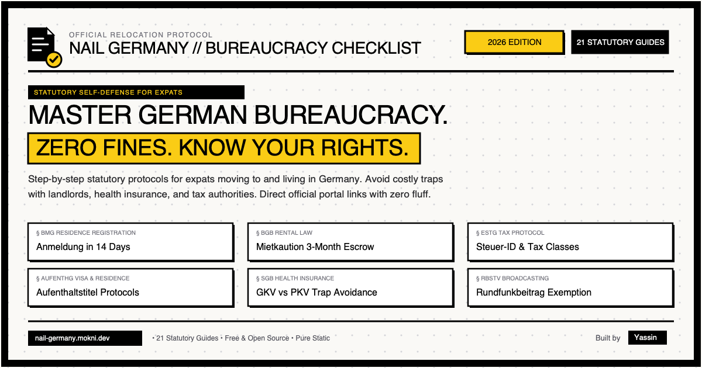

# Nail Germany // German Bureaucracy Checklist

[](./LICENSE)
[](https://nextjs.org/)
[](https://www.typescriptlang.org/)
[](https://nail-germany.mokni.dev)
[](https://nail-germany.mokni.dev)

> **A clear, honest, and free guide to moving to and living in Germany.**
> Know your legal rights, avoid costly mistakes with landlords or health insurance, and get your paperwork done on time.

🌐 **Live Application**: [nail-germany.mokni.dev](https://nail-germany.mokni.dev)

---



---

## Why Nail Germany Exists

Most German relocation websites are affiliate link farms designed to sell expensive expat health insurance packages, overpriced temporary furnished apartments, or unnecessary visa agencies.

**Nail Germany is different:**
- **100% Free and Open Source**: Zero ads, zero sponsored placements, and zero affiliate commissions.
- **Strictly Private**: No user tracking, no cookies, and no email harvesting. All checklist progress is saved purely in your browser's `localStorage`.
- **Statutory Precision**: Every deadline and directive is grounded directly in official German Federal and State statutes (§ BGB, § BMG, § EStG, § AufenthG, § SGB, § RBStV).
- **Official Authority Links Only**: All external links lead directly to official municipal and government bodies (e.g., BAMF, Bundeszentralamt für Steuern, ELSTER, Familienkasse, Mieterverein).

---

## Key Features

1. **Dynamic Profile Questionnaire**:
   - Answer 6 quick questions about your citizenship, employment, family, housing, pets, and church affiliation.
   - Instantly filters out irrelevant administrative tasks (e.g. visa conversions for EU citizens, freelance tax numbers for regular employees).
2. **21 In-Depth Administrative Guides**:
   - Each checklist topic features clear action steps, required documents, statutory deadlines, common bureaucracy traps, estimated processing times, and potential fines.
3. **Dedicated Programmatic SEO Pages (`/guide/[id]/`)**:
   - Every administrative topic has its own pre-rendered static HTML page equipped with Google **`HowTo`**, **`FAQPage`**, and **`BreadcrumbList`** structured data (JSON-LD).
4. **7 Category Hubs (`/category/[slug]/`)**:
   - Structured topic hubs covering *Housing & Rent*, *Immigration & Legal*, *Taxes & Employment*, *Family & Social*, *Finance & Study*, *Legal & Insurance*, and *Housing & Media*.
5. **Printable Protocol**:
   - Built-in `[⎙ PRINT CHECKLIST]` utility generates a clean, single-page paper dossier for in-person appointments at the Bürgeramt or Ausländerbehörde.
6. **High-Contrast Brutalist Aesthetic**:
   - Clean, utilitarian black-and-white visual identity with sharp borders, monospace accents, and zero AI fluff.
7. **LLM & AI-Friendly Endpoints (`llms.txt`)**:
   - Generative Engine Optimized (GEO) for AI search engines (ChatGPT, Perplexity, Claude, Cursor).
   - [llms.txt](https://nail-germany.mokni.dev/llms.txt): Concise Markdown index for AI models.
   - [llms-full.txt](https://nail-germany.mokni.dev/llms-full.txt): Complete statutory knowledge base in a single prompt-ready text file.
   - [tasks.json](https://nail-germany.mokni.dev/tasks.json): Public structured JSON API for developer tools and MCP agents.

---

## Tech Stack

- **Framework**: [Next.js 16](https://nextjs.org/) (App Router, static export with Turbopack)
- **Styling**: [Tailwind CSS v4](https://tailwindcss.com/)
- **State Management**: [Zustand](https://github.com/pmndrs/zustand) with `persist` middleware (`localStorage`)
- **Icons**: [Lucide React](https://lucide.dev/)
- **SEO & Schema**: Programmatic static params generation, JSON-LD (`HowTo`, `FAQPage`, `BreadcrumbList`, `CollectionPage`, `WebApplication`), automated `sitemap.xml`, and `robots.txt`
- **Hosting**: Netlify static deployment via [netlify.toml](./netlify.toml)

---

## Local Development

### Prerequisites
- Node.js 18.18+ or 20+
- npm

### Installation

```bash
# Clone the repository
git clone https://github.com/yassin-mokni/nail-germany.git
cd nail-germany

# Install dependencies
npm install

# Start the development server
npm run dev
```

Visit [http://localhost:3000](http://localhost:3000) in your browser.

### Scripts

```bash
npm run dev     # Starts development server with Turbopack
npm run build   # Compiles static production build into ./out
npm run lint    # Runs ESLint checks (strict TypeScript checks)
```

---

## Project Structure

```text
nail-germany/
├── data/
│   └── tasks.json              # Source of truth: 21 administrative task guides
├── public/
│   ├── og-image.png            # 1200x630 brutalist OpenGraph preview image
│   └── robots.txt              # Search engine bot directives
├── src/
│   ├── app/
│   │   ├── category/[slug]/    # 7 static category cluster hub pages
│   │   ├── guide/[id]/         # 21 static administrative guide pages
│   │   ├── icon.svg            # Official administrative document favicon
│   │   ├── layout.tsx          # Root layout with OpenGraph & canonical metadata
│   │   ├── page.tsx            # Interactive dashboard & homepage directory index
│   │   └── sitemap.ts          # Static sitemap generator (33 routes)
│   ├── components/
│   │   ├── Dashboard.tsx       # Main checklist interface with filtering
│   │   ├── DirectoryIndex.tsx  # Crawlable static directory index for SEO
│   │   ├── Footer.tsx          # Understated footer with author & repo attribution
│   │   ├── GuideDetail.tsx     # Single-task guide view with rich facts & FAQs
│   │   ├── Header.tsx          # Clean header with logo and print action
│   │   ├── Logo.tsx            # Administrative document with checkmark icon
│   │   ├── OnboardingForm.tsx  # 6-step interactive profile questionnaire
│   │   ├── ProfileSummary.tsx  # Interactive user profile badge ribbon
│   │   └── TaskCard.tsx        # Expandable checklist item card
│   ├── lib/
│   │   └── tasks.ts            # Query utilities for tasks and categories
│   ├── store/
│   │   └── useTrackerStore.ts  # Zustand store with localStorage persistence
│   └── types/
│       └── index.ts            # TypeScript interfaces for tasks, profile, and FAQs
├── CONTRIBUTING.md             # Guide for proposing new tasks or legal updates
├── LICENSE                     # MIT License
└── netlify.toml                # Netlify edge deployment configuration
```

---

## Contributing

Contributions from fellow expats, lawyers, workers, and developers are warmly welcomed!

Whether you are:
- Updating outdated administrative fees or Bürgeramt regulations
- Adding a missing checklist guide
- Fixing typos or improving language clarity
- Translating guides

Please check out our [Contributing Guide (CONTRIBUTING.md)](./CONTRIBUTING.md) for instructions on how to propose changes to `data/tasks.json`.

---

## License

This project is licensed under the [MIT License](./LICENSE) - free and open source.

---

## Author & Credits

Built by **[Yassin](https://mokni.dev)**.
Feel free to connect on [mokni.dev](https://mokni.dev) or contribute via Pull Request.
